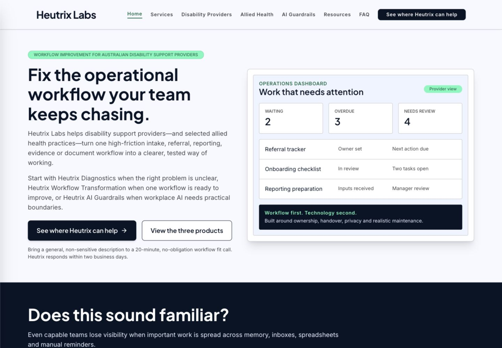
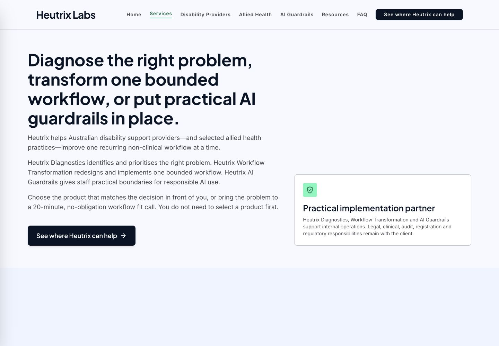
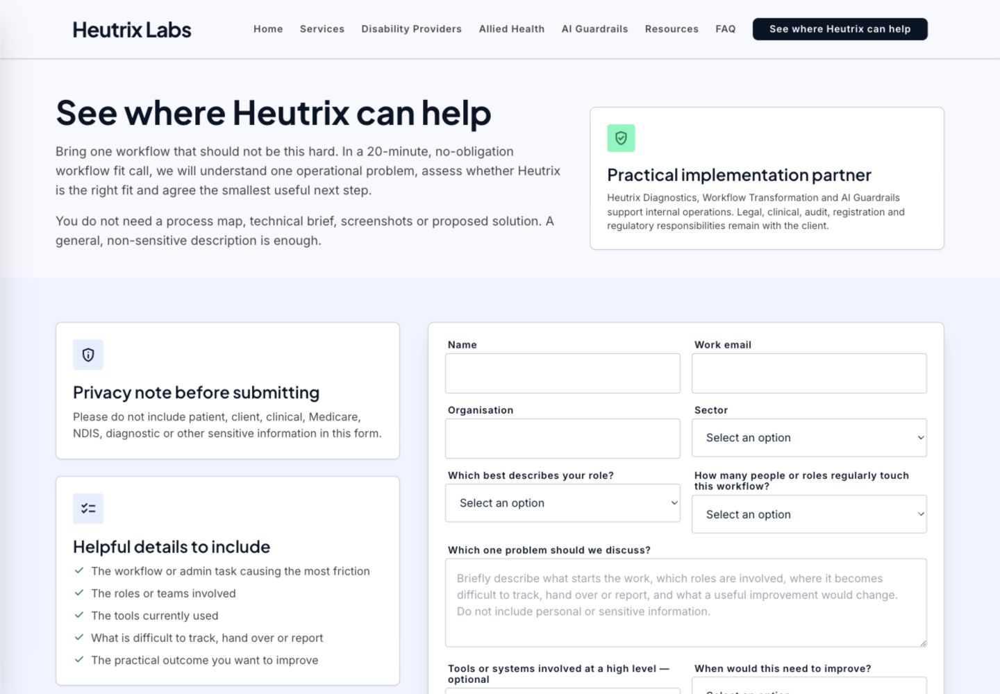
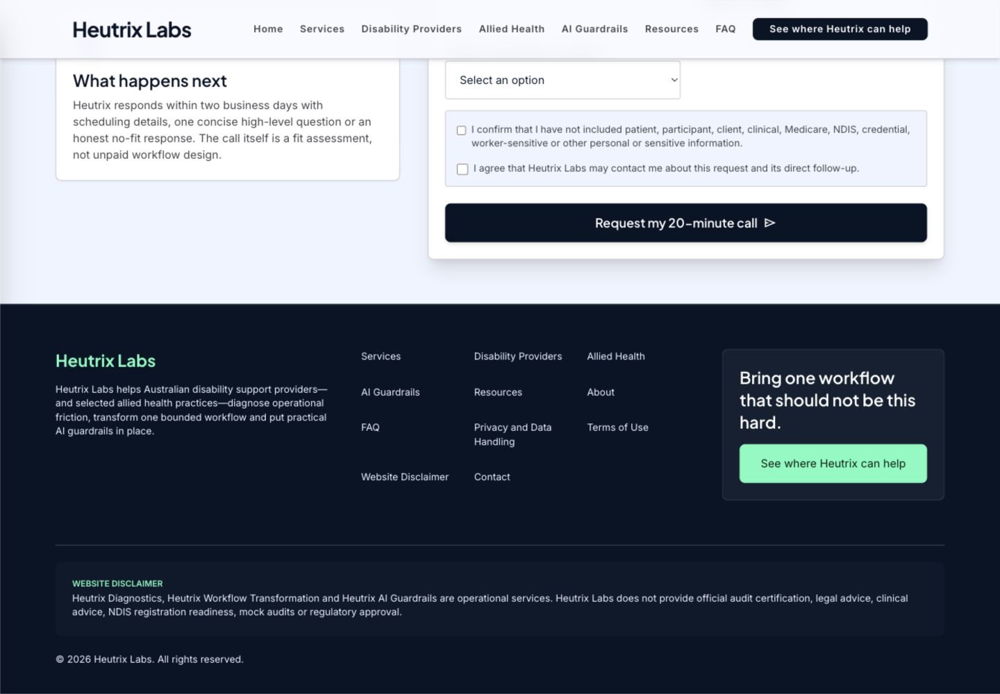
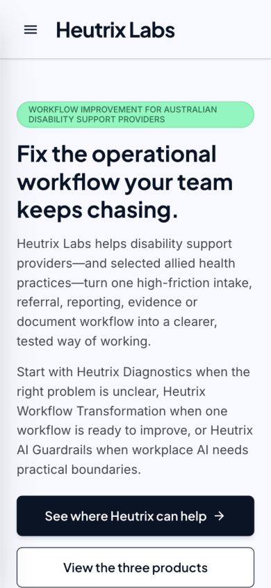
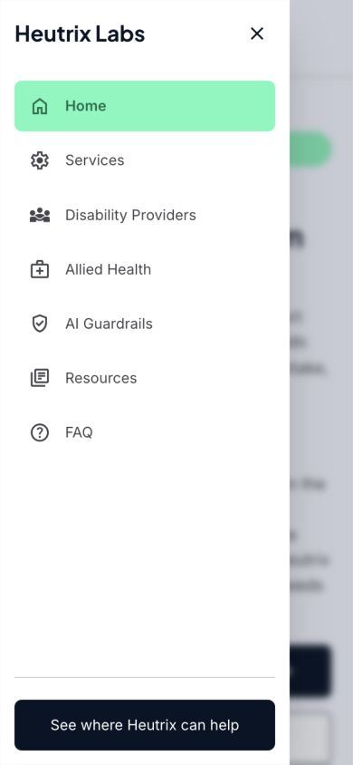

# Heutrix website acquisition and product audit

**Audit date:** 4 September 2026  
**Public site reviewed:** <https://heutrix-labs.janith.workers.dev/>  
**Status:** research and audit evidence only; this document does not approve a claim, release, legal position, platform, price, guarantee or operating change  
**Supersession note:** this is the repository-grounded rerun of the site-only acquisition review. Current decisions, verified assets and operating records take precedence over the earlier diagnosis.

## Integration status — 4 September 2026

The safe local recommendations from this audit are now integrated into the active website and controlled copy as an **undeployed release candidate**. The home-page hierarchy, services decision aid, staged form presentation, accessibility foundations, HTTP legacy redirects and baseline headers were built and checked locally. No lead destination, analytics, unresolved claim or external system was added.

See the [integration record](INTEGRATION-RECORD.md) for exact changes and evidence, and the [H6 deferred note](H6-TECHNICAL-SEO-DEFERRED-NOTE.md) for the production-domain, crawler and genuine-404 decisions that remain open.

## Bottom line

The website is substantially more mature than a surface-only conversion audit suggests. It has a clear niche, a coherent three-product architecture, strong boundaries, a useful problem-first call and three approved ungated resources delivered through six downloadable files. The design is polished and the language is unusually disciplined for an early-stage consultancy.

The limiting factor is not a missing sales trick. It is the gap between public interest and an evidenced operating system:

1. the enquiry form is deliberately non-operational because no approved destination is connected;
2. business identity, public founder information, insurance, legal approval and data-handling controls remain open;
3. there is no approved client proof or synthetic demonstration asset; and
4. several technical signals are implemented only in the browser, not at the HTTP or crawler layer.

Until those gates close, Heutrix has a credible public explanation of its work, not an outreach-ready conversion journey. The safest high-leverage website work now is to reduce repetition, make Workflow Transformation more obviously primary, restore a compact service-choice aid, make the long qualification form easier to complete without weakening its safeguards, and harden SEO/accessibility behaviour locally. None of that should be represented as closing the operational launch gates.

## What repository context corrected

| Surface-only interpretation | Repository-grounded finding | Audit treatment |
|---|---|---|
| Add a pricing page or starting price to reduce uncertainty. | A dated 3 September decision explicitly excludes public prices, ranges, pricing navigation and pricing CTAs. Pricing model approval controls private quoting only. | Do not add public pricing. Explain the written-scope process clearly and keep fees private. |
| Replace the non-working form with a success state or instant booking. | The form intentionally prevents submission and displays a truthful not-sent error because no approved lead destination or scheduler has been verified. | Treat this as a P0 operating gate. Never simulate success. Connect it only after destination, ownership, privacy and end-to-end tests are approved. |
| Add founder names, headshots, credentials and company details for trust. | Those facts are not yet evidenced or approved in the control records. | Treat trust as an owner-evidence workstream. Do not invent or infer identity, qualifications, insurance, address or service-area claims. |
| Lead magnets solve the proof problem. | The resources are approved and deployed, but the registers explicitly say they demonstrate method and are not client proof. | Keep them ungated and useful. Build a separately approved, clearly labelled synthetic/sample deliverable. |
| Add analytics immediately. | Privacy-safe attribution is an open approval gate. | Do not add ad hoc tracking. Define the minimum measurement purpose, data flow, notice and retention first. |
| The site needs a broader offer menu. | The controlled architecture deliberately contains Heutrix Diagnostics, Heutrix Workflow Transformation and Heutrix AI Guardrails; Workflow Transformation is the primary implementation product. | Strengthen hierarchy inside the three-product model. Do not recreate the retired six-service menu. |

## Scope and evidence

The audit used:

- the repository control layer, offer/pricing records, sales path, legal/privacy status, proof registers, approved website copy and active Vite/React source;
- a fresh visual walkthrough on 4 September 2026 at 1440 × 1000 and 390 × 844;
- a production build of `apps/website/`;
- public HTTP/header checks for the home page, crawler files, legacy routes and an unknown route;
- the [Acquisition.com value equation checklist](https://www.acquisition.com/hubfs/Offer%20Checklists%20-%20PDF%20Downloads/Pricing-Value-Checklist.pdf?hsLang=en), [offer creation checklist](https://www.acquisition.com/hubfs/Offer%20Checklists%20-%20PDF%20Downloads/Offer%2BCreation%2BChecklist.pdf) and [guarantee checklist](https://www.acquisition.com/hubfs/Offer%20Checklists%20-%20PDF%20Downloads/Unbeatable-Guarantee-Checklist.pdf) as diagnostic lenses only; and
- [OpenAI prompting guidance](https://developers.openai.com/api/docs/guides/latest-model) for the revised implementation brief: outcome first, explicit constraints, evidence, side effects and acceptance criteria.

The key repository authorities were the [launch board](../../00-control/LAUNCH-BOARD.md), [decision register](../../00-control/DECISIONS.md), [verified facts](../../00-control/VERIFIED-FACTS.md), [risk register](../../00-control/RISKS-AND-BLOCKERS.md), [website refinement brief](../../06-marketing/website-copy/WEBSITE-REFINEMENT-BRIEF-2026-09-03.md), [pricing policy](../../02-market-and-offers/pricing/PRICING-POLICY.md), [owner validation register](../../02-market-and-offers/offers/offer-strategy-2026-09/05-owner-validation-register.md), [lead handling rules](../../03-sales/lead-capture/LEAD-HANDLING.md), [proof register](../../02-market-and-offers/proof/PROOF-REGISTER.md) and [legal review register](../../05-legal-privacy-risk/review-register/LEGAL-REVIEW-REGISTER.md).

Acquisition.com concepts are not treated as adopted Heutrix strategy. In particular, the audit rejects public pricing, unsupported guarantees, fabricated proof, false urgency and artificial scarcity because they conflict with current decisions and safety boundaries.

## Acquisition diagnosis

These scores are audit judgement, not verified business facts.

| Lens | Score | Diagnosis |
|---|---:|---|
| Desired outcome | 7/10 | The site names recognisable problems—lost ownership, unclear status, repeated follow-up and reporting friction—and keeps the promise controllable. The hero could express the buyer's operating outcome before explaining the method. |
| Perceived likelihood | 3/10 | Boundaries and specificity build credibility, but no approved human trust layer, client proof or sample delivery artefact shows that Heutrix can execute the promise. This is the largest offer gap. |
| Time delay | 6/10 | The 20-minute fit call and typical 2–4 week bounded implementation create useful time anchors. The first visible milestone or first-value moment is not yet vivid. Exact timing must remain scope-dependent. |
| Effort and sacrifice | 6/10 | One bounded workflow, use of existing systems and clear client responsibilities reduce perceived disruption. Long pages and eleven required form controls add buyer effort before a conversation. |
| Offer clarity | 7/10 | The three products are coherent, differentiated and safely described. Equal first presentation makes Workflow Transformation less obviously primary than the strategy requires. |
| Conversion readiness | 2/10 | Calls to action are consistent and honest, but the lead path cannot deliver an enquiry. The score reflects operating readiness, not visual quality. |

### Core commercial implication

Do not make the public promise louder until the evidence and fulfilment system are stronger. The next lift in perceived value should come from:

1. an approved, clearly labelled sample showing what a bounded workflow transformation produces;
2. verified founder/company information that a buyer can independently trust;
3. a working, privacy-aligned lead and follow-up path; and
4. simpler decision and completion paths using the claims already approved.

## Journey walkthrough

### 1. Home, desktop — good foundation

**Healthy:** The first screen identifies the primary segment, states a concrete operational problem and offers one clear primary action plus a useful self-serve resource. The visual style is restrained, professional and consistent with the brand system.

**Friction:** The headline leads with the Heutrix method rather than the buyer's desired operating state. After the hero, the page repeats the problem, scorecard, three products, Workflow Transformation, method, capabilities, trust narrative and five illustrative examples before the final form. The cumulative length makes the next decision harder to retain, especially on mobile.

**Recommendation:** Keep the hero's specificity and boundaries, but restructure the home page into a tighter sequence: outcome/problem → proof of method → primary product → three-product routing → boundaries → CTA. Consolidate repeated method/capability/trust sections rather than writing net-new claims.

### 2. Services, desktop — clear products; weak comparison hierarchy

**Healthy:** All three products are named correctly and the boundary card makes the operating role clear. The copy tells visitors that they do not need to diagnose the product themselves.

**Friction:** The opening gives the three products roughly equal visual weight, although Workflow Transformation is the primary implementation product. The controlled copy contains enough material to create a compact “choose by the decision in front of you” comparison, but the current first screen does not provide it.

**Recommendation:** Add a compact decision aid near the top—problem state, appropriate product, smallest next step—and visually distinguish Workflow Transformation as the implementation route. Preserve Diagnostics and AI Guardrails as first-class products and keep the fit process responsible for final routing.

### 3. Contact entry, desktop — clear expectation; high commitment

**Healthy:** The page explains the 20-minute agenda, asks for no sensitive information and states that the call is a fit assessment rather than unpaid consulting. Response timing is explicit.

**Friction:** The form begins as a large all-at-once commitment. Current source contains eleven required controls plus an optional tools field, with an additional optional observation when arriving from a resource. Every field has a rationale in the controlled copy, so the issue is presentation and sequencing, not arbitrary field removal.

**Recommendation:** Keep the approved fields and safety confirmations, but present them in two clear visual stages: contact/context first, then workflow/decision/safety. Retain values when moving between stages, expose progress, support back navigation and place the truthful submission state only on the final action. Validate this design with users before assuming it improves completion.

### 4. Contact completion — safe failure; operationally blocked

**Healthy:** Consent and sensitive-information confirmations are explicit. The failure message is announced with `role="alert"` and `aria-live="polite"`. The implementation never falsely claims receipt.

**Critical gap:** Submitting always prevents the browser request and shows that the request was not sent. This is correct for the current evidence state and still blocks outreach at scale.

**Recommendation:** Do not alter this behaviour as a design-only task. Close B1/B5/H3 operating decisions first, then implement the real endpoint with server-confirmed receipt, spam/duplicate handling, source and consent records, monitored ownership, safe errors and pipeline verification.

### 5. Home, mobile — usable but dense above the fold

**Healthy:** There is no visible clipping or horizontal overflow in the captured state. The headline, body, two actions and explanatory note remain readable.

**Friction:** The entire first viewport is consumed by the long hero and both actions; no proof-of-method or next-step context appears without scrolling. The long desktop information architecture becomes materially longer on mobile.

**Recommendation:** Tighten the mobile hero copy only within the approved message, reduce redundant explanation below it and bring one confidence-building proof-of-method element closer to the first action. Do not substitute an unverified outcome claim.

### 6. Mobile navigation — healthy with a verification item

**Healthy:** Navigation labels are direct, the primary CTA is prominent and the implementation includes focus trapping, Escape close and focus restoration.

**Verification item:** The menu/close controls appear close to a 40 px interaction box and there is no shared explicit `:focus-visible` treatment for links and buttons in the source. Confirm 44 × 44 px targets, visible keyboard focus, 200% zoom/reflow and screen-reader behaviour in the final QA workstream.

## Priority gap register

| Priority | Finding | Evidence | Recommended action | Gate/owner |
|---|---|---|---|---|
| P0 | Enquiry submission cannot reach Heutrix. | The current form always prevents submission and the control register identifies this as a launch blocker. | Complete the real lead-path workstream and end-to-end valid, invalid, duplicate, consent, alert and pipeline tests. | Owner decision on destination, owner/backup, scheduler and handling; privacy/legal review. |
| P0 | Identity, legal, insurance and approved data handling remain unresolved. | `RISKS-AND-BLOCKERS.md` records each as open. | Close the evidence registers before naming facts publicly or onboarding paid work. | Owner, legal reviewer and operating owners. |
| P1 | No verified public proof exists. | Both proof registers prohibit treating resources or illustrative examples as client outcomes. | Approve one clearly labelled synthetic/sample deliverable that shows the actual process, artefacts and boundaries. | Owner and boundary reviewer. |
| P1 | Workflow Transformation is not dominant enough at the first service decision. | Strategy names it as primary; the services first screen treats all three products similarly. | Add a compact decision comparator and visual primary-product emphasis using controlled copy. | Local copy/design work; owner review before publication. |
| P1 | Home page repetition dilutes the next action. | Fresh walkthrough and source order show several overlapping method, capability, trust and illustrative-example sections. | Consolidate sections and keep one narrative job per block. | Local copy/design work; mirror public wording changes in the copy pack. |
| P1 | Qualification form presents eleven required controls at once. | Current `ContactForm` source and fresh desktop capture. | Test a two-stage presentation without dropping approved qualification or safety fields. | Local UX work; endpoint remains gated. |
| P1 | Resource status is internally inconsistent. | Launch board and release manifest record approval/deployment, while `VERIFIED-FACTS.md` line 19 and parts of the owner validation register still describe release/deployment as open. | Reconcile only the stale status fields to the dated release evidence; keep measurement and proof gaps open. | Control-record maintenance. |
| P1 | Crawler and HTTP behaviour is incomplete. | `/robots.txt` and `/sitemap.xml` return the SPA HTML shell as `text/html`; unknown, `/pricing` and `/safe-ai` return HTTP 200. Route titles/descriptions are changed only by browser JavaScript. | Run H6: add real crawler files, canonical/social metadata, genuine server/asset redirects and an architecture that returns 404 for unknown paths. | Production domain decision precedes canonical/Search Console work. |
| P1 | Accessibility treatment is incomplete in source. | Form controls have focus rings, but no shared explicit focus-visible rule was found for links/buttons; extensive Framer Motion has no reduced-motion treatment. | Add shared focus-visible styling, reduced-motion behaviour and minimum target sizes; verify by keyboard, zoom and assistive-technology testing. | B6 final QA after integrated changes. |
| P2 | Response security headers are minimal. | Sampled public HTML response did not include an explicit CSP, `X-Content-Type-Options`, `Referrer-Policy` or `Permissions-Policy`. | Review a narrowly scoped `public/_headers` policy against required font/assets behaviour; test before release. | Technical/security review. |
| P2 | Privacy-safe measurement is intentionally absent. | Launch board keeps attribution approval open. | Define the smallest decision-useful measurement plan before enabling analytics or resource attribution. | Owner and privacy review. |

Cloudflare currently supports `_redirects` and `_headers` files for Worker static assets, but the H6 task should verify the behaviour in this exact SPA configuration before relying on them: [redirects](https://developers.cloudflare.com/workers/static-assets/redirects/) and [headers](https://developers.cloudflare.com/workers/static-assets/headers/).

## Staged plan

### Gate 0 — reconcile current truth

- Update only stale resource release/deployment status entries that conflict with the dated launch board and release manifest.
- Do not close privacy-safe measurement, proof, lead handling, legal, identity, insurance or onboarding gates.

### Gate 1 — close owner and operating decisions

- Verify public entity/contact/founder facts and allowed claims.
- Approve one synthetic/sample proof asset and its exact label.
- Approve the lead destination, owner/backup, calendar path, fit rules, follow-up service level and data flow.
- Complete legal/privacy and systems decisions needed for real enquiries.

### Gate 2 — implement reversible local improvements

- Consolidate the home-page narrative using controlled copy.
- Restore a compact service decision comparator and make Workflow Transformation visibly primary.
- Present the qualification form in two accessible stages while preserving every approved field and the truthful not-sent behaviour.
- Add explicit keyboard focus, reduced-motion and touch-target treatments.
- Implement real crawler files and verified static-asset redirects/headers where compatible.
- Do not deploy.

### Gate 3 — connect conversion infrastructure

- Wire the approved endpoint, scheduler/pipeline path and monitored ownership.
- Record source and permission separately.
- Show success only after server-confirmed receipt.
- Run privacy, failure, duplicate, spam, alert and follow-up tests end to end.

### Gate 4 — release and learn

- Obtain the required content, privacy/legal and operational approvals.
- Build, test desktop/mobile/keyboard/crawler behaviour and deploy to the existing Worker only.
- Verify the public origin after deployment.
- Begin measurement only after the approved notice and data flow are in place.

## Explicitly excluded recommendations

Do not add or imply:

- a public pricing page, public fee/range or pricing CTA;
- an automatic Diagnostic credit or unapproved commercial guarantee;
- fake urgency, scarcity, capacity or countdowns;
- invented clients, testimonials, quantified outcomes, credentials or experience;
- named tools, integrations or platforms without capability and data-path approval;
- a successful enquiry or booked time before server-confirmed receipt and scheduler completion;
- analytics, pixels or cross-site attribution before privacy approval; or
- removal or weakening of the current privacy, professional and scope boundaries.

## Verification record

- `npm run build` in `apps/website/`: passed on 4 September 2026; 421 modules transformed.
- Fresh desktop and mobile screenshots: captured and visually inspected on 4 September 2026.
- Public HTTP checks: home returned 200 HTML; `robots.txt` and `sitemap.xml` returned 200 HTML; unknown route returned 200 HTML; `/pricing` and `/safe-ai` returned 200 HTML at the HTTP layer. A fresh browser check confirmed that client JavaScript then replaces those legacy URLs with `/services#how-engagements-are-agreed` and `/ai-guardrails` respectively.
- Source checks: route-specific title/description updates are client-side; no canonical, Open Graph, Twitter card, JSON-LD, crawler files, explicit shared focus-visible rule or reduced-motion handling was found.
- Limit: this audit did not submit real data, test a physical mobile device, use a screen reader, validate a production form endpoint, inspect external accounts or approve any business claim.
